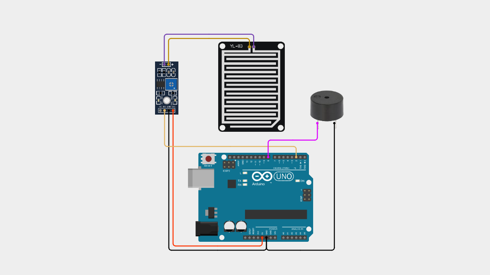

# Arduino Rain Sensor with Buzzer Alert

A beginner-friendly Arduino project demonstrating how to detect rain using a rain sensor module (FC-37 / YL-83) and trigger a buzzer alert.

This project uses the digital output (DO) of the rain sensor to detect wet or dry conditions and activate a buzzer when rain is detected.

---

## 📌 Project Overview

The rain sensor detects water by measuring conductivity on its probe surface.

When water is present, the module outputs a digital signal that can be read by Arduino.

This project allows you to:

- Detect rain (wet condition)  
- Trigger a buzzer alarm  
- Build a simple rain alert system  

This example is designed for beginners with simple wiring and clean code.

---

## 🧰 Components Required

- Arduino Uno / Nano  
- Rain Sensor Module (FC-37 / YL-83)  
- Active Buzzer  
- Jumper Wires  
- Breadboard (optional)  

---

## 🔌 Wiring Connections

| Rain Sensor | Arduino |
|------------|----------|
| VCC        | 5V       |
| GND        | GND      |
| DO         | Pin 2    |

| Buzzer     | Arduino |
|------------|----------|
| (+)        | Pin 8    |
| (-)        | GND      |

---

## 📷 Wiring Diagram

> Make sure your wiring matches the diagram above before uploading the code.

---

## 💻 Arduino Code

You can download the Arduino sketch here:

[Download Arduino Code](Arduino_Rain_Sensor_with_Buzzer_Alert.ino)

Or open the `.ino` file directly inside this repository.

---

## 🚀 Getting Started

1. Connect all components according to the wiring table.
2. Upload the provided Arduino sketch.
3. Open **Serial Monitor**.
4. Set baud rate to **9600**.
5. Pour some water on the sensor probe.
6. Observe the buzzer sound when rain is detected.

---

## 🧠 Learning Concepts

This project helps you understand:

- Digital input reading  
- Sensor-based detection  
- Basic alert system  
- Arduino I/O control  
- Serial communication basics  

---

## 🎥 Video Tutorial

Watch the full step-by-step tutorial on YouTube:

In this video, you will see:
- Complete wiring demonstration  
- Code explanation  
- Live rain detection testing  
- Buzzer alert behavior  

If this project helps you, consider subscribing for more beginner-friendly Arduino tutorials 🚀

---

## 📄 License

This project is open-source and free to use for educational purposes.

---

Happy Coding 🚀
